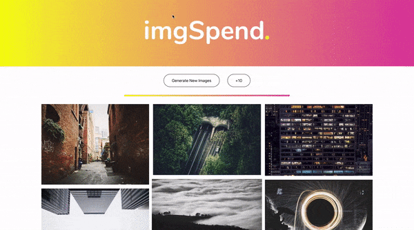

# imgSpend.

imgSpend. is a web-app that fetches and displays random images from the Unsplash image API.

## Setup

```
npm install
npm run serve
```

## Demo



### Technologies

Vue.js | JavaScript, WebAPIs

### Features

- Fetching of 50 random images, displayed in a responsive grid

- Load more images on the page (10 at a time)

- Load an entirely new set of images

- Clickable images with link to the Unsplash page & author details
